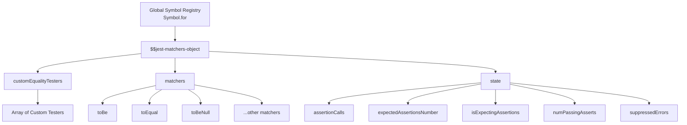
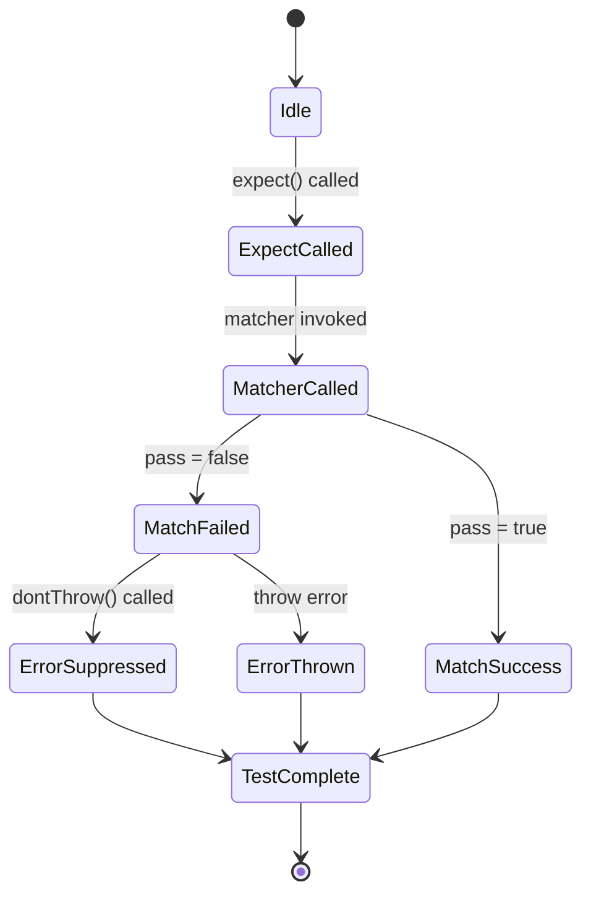
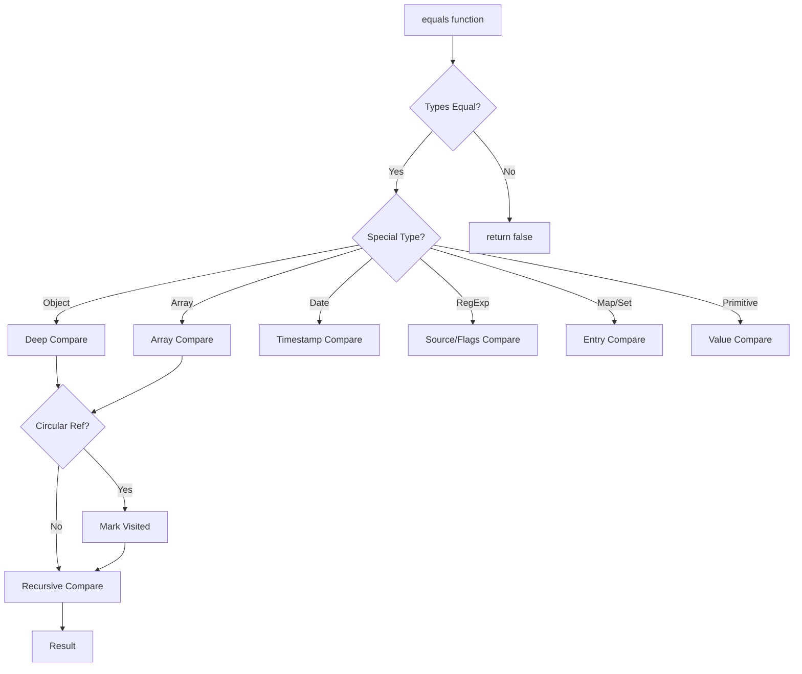
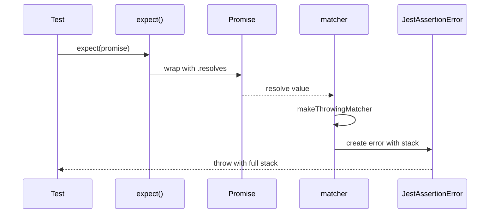

# Jest 斷言系統：expect 與 matchers 的實現原理

> 原文出處：[CSDN - Jest 斷言系統：expect 與 matchers 的實現原理](https://blog.csdn.net/gitblog_01065/article/details/148325015)
> 版權：原創，遵循 CC 4.0 BY-SA 版權協議

---

Jest 的斷言系統基於高度模組化和可擴展的架構設計，通過全局符號註冊表、自定義匹配器機制和異步處理能力，為開發者提供了強大而靈活的斷言功能。expect 包作為核心組件，採用全域單例模式確保匹配器狀態一致性，同時支援自定義相等性測試器和異步操作處理。內建 matchers 則通過精心設計的比較演算法和錯誤處理機制，提供了豐富的類型檢查和值比較功能。

---

## 1. expect 包架構與擴展機制

Jest 的 expect 包是整個斷言系統的核心，它採用了高度模組化和可擴展的架構設計。expect 包通過全局符號註冊表、自定義匹配器機制和異步處理能力，為開發者提供了強大而靈活的斷言功能。

### 1.1 核心架構設計

expect 包的架構基於全域單例模式，通過 `Symbol.for('$$jest-matchers-object')` 在全域作用域中維護一個唯一的匹配器對象。這個設計確保了在同一個測試環境中所有匹配器狀態的一致性。



### 1.2 全域匹配器對象機制

expect 包使用全局符號來存儲和管理匹配器狀態，這種設計確保了在模組化環境中也能保持狀態的一致性：

```javascript
// 全局匹配器對象的符號標識
const JEST_MATCHERS_OBJECT = Symbol.for('$$jest-matchers-object');

// 內部匹配器標誌
export const INTERNAL_MATCHER_FLAG = Symbol.for('$$jest-internal-matcher');

// 初始化全局匹配器對象
if (!Object.prototype.hasOwnProperty.call(globalThis, JEST_MATCHERS_OBJECT)) {
  const defaultState: MatcherState = {
    assertionCalls: 0,
    expectedAssertionsNumber: null,
    isExpectingAssertions: false,
    numPassingAsserts: 0,
    suppressedErrors: [], // 不立即拋出的錯誤
  };

  Object.defineProperty(globalThis, JEST_MATCHERS_OBJECT, {
    value: {
      customEqualityTesters: [],
      matchers: Object.create(null),
      state: defaultState,
    },
  });
}
```

### 1.3 匹配器註冊與擴展機制

expect 包提供了完整的匹配器擴展 API，允許開發者註冊自定義匹配器。擴展機制通過 `setMatchers` 函數實現：

```javascript
export const setMatchers = (
  matchers: MatchersObject,
  isInternal: boolean,
  expect: Expect,
): void => {
  for (const key of Object.keys(matchers)) {
    const matcher = matchers[key];

    // 驗證匹配器類型
    if (typeof matcher !== 'function') {
      throw new TypeError(`expect.extend: \`${key}\` is not a valid matcher.`);
    }

    // 標記內部匹配器
    Object.defineProperty(matcher, INTERNAL_MATCHER_FLAG, {
      value: isInternal,
    });

    if (!isInternal) {
      // 為自定義匹配器創建非對稱匹配器類
      class CustomMatcher extends AsymmetricMatcher<[unknown, ...Array<unknown>]> {
        constructor(inverse = false, ...sample: [unknown, ...Array<unknown>]) {
          super(sample, inverse);
        }

        asymmetricMatch(other: unknown) {
          const {pass} = matcher.call(
            this.getMatcherContext(),
            other,
            ...this.sample,
          ) as SyncExpectationResult;

          return this.inverse ? !pass : pass;
        }

        toString() {
          return `${this.inverse ? 'not.' : ''}${key}`;
        }
      }

      // 註冊到 expect 和 expect.not
      Object.defineProperty(expect, key, {
        value: (...sample: [unknown, ...Array<unknown>]) =>
          new CustomMatcher(false, ...sample),
      });

      Object.defineProperty(expect.not, key, {
        value: (...sample: [unknown, ...Array<unknown>]) =>
          new CustomMatcher(true, ...sample),
      });
    }
  }

  // 合併到全局匹配器對象
  Object.assign((globalThis as any)[JEST_MATCHERS_OBJECT].matchers, matchers);
};
```

### 1.4 自定義相等性測試器

expect 包還支援自定義相等性測試器，用於擴展深度比較的邏輯：

```javascript
export const addCustomEqualityTesters = (newTesters: Array<Tester>): void => {
  if (!Array.isArray(newTesters)) {
    throw new TypeError(
      `expect.customEqualityTesters: Must be set to an array of Testers.`
    );
  }

  (globalThis as any)[JEST_MATCHERS_OBJECT].customEqualityTesters.push(
    ...newTesters,
  );
};
```

### 1.5 異步處理機制

expect 包對異步操作提供了完整的支持，通過 `resolves` 和 `rejects` 修飾符處理 Promise：

```javascript
const makeResolveMatcher = (
  matcherName: string,
  matcher: RawMatcherFn,
  isNot: boolean,
  actual: Promise<any> | (() => Promise<any>),
  outerErr: JestAssertionError,
): PromiseMatcherFn => (...args) => {
  const options = { isNot, promise: 'resolves' };

  const actualWrapper: Promise<any> =
    typeof actual === 'function' ? actual() : actual;

  if (!isPromise(actualWrapper)) {
    throw new JestAssertionError('Received value must be a promise');
  }

  return actualWrapper.then(
    result => makeThrowingMatcher(matcher, isNot, 'resolves', result).apply(null, args),
    error => {
      outerErr.message = 'Received promise rejected instead of resolved';
      throw outerErr;
    }
  );
};
```

### 1.6 狀態管理機制

expect 包維護了一個完整的狀態管理系統，用於跟蹤斷言調用和錯誤處理：

| 狀態屬性 | 類型 | 描述 |
|---------|------|------|
| `assertionCalls` | number | 斷言調用次數 |
| `expectedAssertionsNumber` | number \| null | 期望的斷言數量 |
| `isExpectingAssertions` | boolean | 是否期望有斷言 |
| `numPassingAsserts` | number | 通過的斷言數量 |
| `suppressedErrors` | any[] | 被抑制的錯誤 |



### 1.7 錯誤處理與堆疊追蹤

expect 包提供了專門的錯誤處理機制，通過 JestAssertionError 類來提供清晰的錯誤訊息：

```javascript
export class JestAssertionError extends Error {
  matcherResult?: Omit<SyncExpectationResult, 'message'> & {message: string};
}

const makeThrowingMatcher = (
  matcher: RawMatcherFn,
  isNot: boolean,
  promise: string,
  actual: any,
  err?: JestAssertionError,
): ThrowingMatcherFn => function throwingMatcher(...args): any {
  let throws = true;
  const utils = {
    ...matcherUtils,
    iterableEquality,
    subsetEquality,
  };

  const matcherUtilsThing: MatcherUtils = {
    customTesters: getCustomEqualityTesters(),
    dontThrow: () => (throws = false), // 控制錯誤拋出
    equals,
    utils,
  };

  // ... 匹配器執行邏輯
};
```

這種架構設計使得 expect 包既保持了核心功能的穩定性，又提供了充分的擴展性，讓開發者能夠根據具體需求定制自己的斷言邏輯。

---

## 2. 內置 Matchers 實現原理

Jest 的內置 matchers 是斷言系統的核心組件，它們提供了豐富的比較和驗證功能。這些 matchers 通過精心設計的架構實現了高效、準確的類型檢查和值比較，讓我們深入探索其實現原理。

### 2.1 核心架構設計

Jest 的 matchers 系統採用模組化設計，每個 matcher 都是一個獨立的函數，遵循統一的介面規範：

```typescript
interface MatcherResult {
  message: () => string;
  pass: boolean;
  actual?: unknown;
  expected?: unknown;
  name?: string;
}

type MatcherFunction = (
  received: unknown,
  expected: unknown,
  ...args: any[]
) => MatcherResult;
```

這種設計使得每個 matcher 都能獨立工作，同時又能共用統一的錯誤處理和結果格式化機制。

### 2.2 相等性比較的核心引擎

Jest 使用一個高度優化的 `equals` 函數作為比較引擎，它能夠處理各種複雜的資料類型和結構：



### 2.3 主要 Matchers 的實現機制

#### toBe Matcher - 嚴格相等比較

`toBe` matcher 使用 `Object.is` 進行嚴格相等比較，這是 JavaScript 中最嚴格的相等性檢查：

```typescript
toBe(received: unknown, expected: unknown) {
  const pass = Object.is(received, expected);

  // 當嚴格相等失敗時，嘗試深度相等以提供更好的錯誤訊息
  if (!pass) {
    const expectedType = getType(expected);
    let deepEqualityName = null;

    if (expectedType !== 'map' && expectedType !== 'set') {
      if (equals(received, expected, [...this.customTesters, ...toStrictEqualTesters], true)) {
        deepEqualityName = 'toStrictEqual';
      } else if (equals(received, expected, [...this.customTesters, iterableEquality])) {
        deepEqualityName = 'toEqual';
      }
    }
  }

  return { message, pass };
}
```

#### toEqual Matcher - 深度相等比較

`toEqual` 使用深度比較演算法，能夠遞迴比較物件的屬性和陣列的元素：

```typescript
toEqual(received: unknown, expected: unknown) {
  const customTesters = this.customTesters;
  const pass = equals(received, expected, customTesters);

  return {
    message: () => /* 格式化錯誤訊息 */,
    pass,
    actual: received,
    expected
  };
}
```

深度比較演算法支援的特殊類型處理：

| 資料類型 | 比較方式 | 特殊處理 |
|---------|---------|---------|
| Date 物件 | 時間戳比較 | 使用 `+date` 轉換為毫秒數 |
| RegExp | 模式和標誌比較 | 比較 `source` 和 `flags` 屬性 |
| ArrayBuffer | 二進制資料比較 | 逐位元組比較 |
| DOM 節點 | DOM API 比較 | 使用 `isEqualNode` 方法 |

#### 數字相關 Matchers 的實現

數字比較 matchers 使用精確的數學計算和類型檢查：

```typescript
toBeCloseTo(received: number, expected: number, precision = 2) {
  // 類型檢查
  if (typeof expected !== 'number' || typeof received !== 'number') {
    throw new TypeError('Expected and received must be numbers');
  }

  // 處理 Infinity 特殊情況
  if (received === Number.POSITIVE_INFINITY &&
      expected === Number.POSITIVE_INFINITY) {
    return { pass: true, message: () => '...' };
  }

  // 計算允許的誤差範圍
  const expectedDiff = Math.pow(10, -precision) / 2;
  const receivedDiff = Math.abs(expected - received);
  const pass = receivedDiff < expectedDiff;

  return { pass, message: () => /* 格式化訊息 */ };
}
```

#### 類型檢查 Matchers

類型檢查 matchers 利用 JavaScript 的內省機制：

```typescript
toBeInstanceOf(received: any, expected: Function) {
  if (typeof expected !== 'function') {
    throw new TypeError('Expected value must be a constructor function');
  }

  const pass = received instanceof expected;

  return {
    pass,
    message: () => `Expected value to be an instance of ${expected.name}`
  };
}
```

### 2.4 自定義測試器系統

Jest 提供了強大的自定義測試器系統，允許開發者擴展比較邏輯：

```typescript
// 自定義陣列比較測試器
const arrayCustomTester: Tester = (a, b, customTesters) => {
  if (Array.isArray(a) && Array.isArray(b)) {
    if (a.length !== b.length) return false;
    for (let i = 0; i < a.length; i++) {
      if (!equals(a[i], b[i], customTesters)) return false;
    }
    return true;
  }
  return undefined;
};

// 在 matcher 中使用自定義測試器
toEqual(received, expected) {
  const customTesters = [...this.customTesters, arrayCustomTester];
  const pass = equals(received, expected, customTesters);
  // ...
}
```

### 2.5 錯誤訊息生成系統

Jest 的 matchers 包含一個複雜的錯誤訊息生成系統，能夠根據比較結果生成有意義的錯誤訊息：

```typescript
function generateDiffMessage(expected, received, matcherName) {
  return `
${matcherHint(matcherName)}

Expected: ${printExpected(expected)}
Received: ${printReceived(received)}

${printDiffOrStringify(expected, received, 'Expected', 'Received')}
`;
}
```

這個系統使用顏色編碼、類型訊息和差異顯示來幫助開發者快速定位問題。

### 2.6 效能優化策略

Jest 在 matchers 實現中採用了多種效能優化策略：

1. **短路評估**：在比較過程中儘早返回結果
2. **引用相等檢查**：首先檢查物件引用是否相同
3. **類型優先比較**：根據資料類型選擇最優比較演算法
4. **循環引用檢測**：防止無限遞迴

### 2.7 異步 Matchers 支援

對於異步操作，Jest 提供了特殊的處理機制：

```typescript
// 異步 matcher 的包裝器
function createAsyncMatcher(syncMatcher) {
  return async function asyncMatcher(...args) {
    const result = syncMatcher.apply(this, args);
    if (result instanceof Promise) {
      return result.then(syncResult => ({
        ...syncResult,
        actual: await syncResult.actual,
        expected: await syncResult.expected
      }));
    }
    return result;
  };
}
```

這種設計使得同步 matchers 可以無縫地用於異步測試場景。

Jest 的內置 matchers 通過精心的架構設計和演算法優化，提供了強大而靈活的斷言能力。其核心在於高效的相等性比較演算法、智慧的錯誤訊息生成和可擴展的自定義測試器系統，這些特性共同構成了 Jest 斷言系統的堅實基礎。

---

## 3. 自定義 Matchers 開發指南

Jest 提供了強大的自定義 matchers 擴展能力，允許開發者根據項目特定需求創建專屬的斷言工具。通過 `expect.extend()` 方法，你可以構建高度可讀、領域特定的測試斷言，大幅提升測試程式碼的可維護性和表達力。

### 3.1 基礎 Matcher 結構

每個自定義 matcher 都是一個接收實際值和期望參數的函數，返回包含 `pass` 布林值和 `message` 函數的物件：

```javascript
function customMatcher(actual, expected) {
  const pass = /* 驗證邏輯 */;

  return {
    pass,
    message: () => pass
      ? `預期 ${actual} 不應該滿足條件`
      : `預期 ${actual} 應該滿足條件`
  };
}
```

### 3.2 完整開發示例

以下是一個檢查數字是否在指定範圍內的 matcher 實現：

```javascript
function toBeWithinRange(actual, floor, ceiling) {
  if (typeof actual !== 'number' ||
      typeof floor !== 'number' ||
      typeof ceiling !== 'number') {
    throw new TypeError('所有參數必須為數字類型');
  }

  const pass = actual >= floor && actual <= ceiling;

  return {
    pass,
    message: () =>
      pass
        ? `預期 ${this.utils.printReceived(actual)} 不在 ${floor} - ${ceiling} 範圍內`
        : `預期 ${this.utils.printReceived(actual)} 在 ${floor} - ${ceiling} 範圍內`
  };
}

// 註冊自定義 matcher
expect.extend({ toBeWithinRange });
```

### 3.3 Matcher 上下文工具

在 matcher 函數內部，`this` 上下文提供了豐富的工具函數：

| 工具屬性 | 描述 | 使用示例 |
|---------|------|---------|
| `this.isNot` | 是否使用 `.not` 修飾符 | `this.isNot ? '不應該' : '應該'` |
| `this.promise` | Promise 狀態標識 | `this.promise === 'resolves'` |
| `this.equals()` | 深度比較函數 | `this.equals(a, b)` |
| `this.utils` | 格式化工具集 | `this.utils.printReceived(value)` |

```javascript
function toBeDeepEqual(actual, expected) {
  const pass = this.equals(actual, expected);

  return {
    pass,
    message: () => {
      const hint = this.utils.matcherHint('toBeDeepEqual', undefined, undefined, {
        isNot: this.isNot,
        promise: this.promise
      });

      return pass
        ? `${hint}\n\n預期值不應該深度相等`
        : `${hint}\n\n${this.utils.diff(expected, actual)}`;
    }
  };
}
```

### 3.4 異步 Matcher 開發

對於需要異步操作的 matcher，只需返回 Promise 即可：

```javascript
expect.extend({
  async toBeDivisibleByExternalValue(actual) {
    const externalValue = await fetchExternalValue();
    const pass = actual % externalValue === 0;

    return {
      pass,
      message: () => `預期 ${actual} ${pass ? '不' : ''}能能被 ${externalValue} 整除`
    };
  }
});

// 使用示例
test('異步 matcher 測試', async () => {
  await expect(100).toBeDivisibleByExternalValue();
});
```

### 3.5 類型安全的 TypeScript 支援

在 TypeScript 項目中，需要為自定義 matcher 添加類型聲明：

```typescript
// custom-matchers.d.ts
declare namespace jest {
  interface Matchers<R> {
    toBeWithinRange(floor: number, ceiling: number): R;
    toBeDivisibleByExternalValue(): Promise<R>;
  }

  interface Expect {
    toBeWithinRange(floor: number, ceiling: number): any;
    not: {
      toBeWithinRange(floor: number, ceiling: number): any;
    };
  }
}

export {};
```

### 3.6 高級模式：組合現有 Matchers

你可以基於現有 matchers 構建更複雜的自定義 matcher：

```javascript
function toBeValidEmail(actual) {
  const emailRegex = /^[^\s@]+@[^\s@]+\.[^\s@]+$/;
  const pass = typeof actual === 'string' && emailRegex.test(actual);

  if (!pass) {
    // 使用內置 matcher 提供更好的錯誤訊息
    return {
      pass: false,
      message: () => `預期收到有效的郵箱地址，但收到: ${this.utils.printReceived(actual)}`
    };
  }

  return { pass: true, message: () => '' };
}
```

### 3.7 錯誤處理最佳實踐

良好的錯誤處理能顯著提升開發者體驗：

```javascript
function toBeValidUrl(actual, protocol) {
  if (typeof actual !== 'string') {
    throw new TypeError(
      `預期收到字符串類型的 URL，但收到: ${this.utils.printReceived(actual)}`
    );
  }

  let url;
  try {
    url = new URL(actual);
  } catch {
    return {
      pass: false,
      message: () => `預期收到有效的 URL: ${this.utils.printReceived(actual)}`
    };
  }

  const pass = protocol ? url.protocol === `${protocol}:` : true;

  return {
    pass,
    message: () =>
      `預期 URL ${pass ? '不' : ''}應該使用 ${protocol} 協議`
  };
}
```

### 3.8 測試自定義 Matchers

為確保自定義 matchers 的可靠性，應編寫完整的測試套件：

```javascript
describe('自定義 matchers 測試', () => {
  test('toBeWithinRange 正常情況', () => {
    expect(5).toBeWithinRange(1, 10);
    expect(15).not.toBeWithinRange(1, 10);
  });

  test('toBeWithinRange 錯誤處理', () => {
    expect(() => expect('string').toBeWithinRange(1, 10))
      .toThrow('所有參數必須為數字類型');
  });

  test('異步 matcher 測試', async () => {
    await expect(100).toBeDivisibleByExternalValue();
    await expect(97).not.toBeDivisibleByExternalValue();
  });
});
```

### 3.9 效能優化技巧

對於效能敏感的場景，可以採用以下優化策略：

```javascript
function toBeCachedValue(actual, key) {
  // 緩存計算結果避免重複運算
  if (!this._cache) this._cache = new Map();

  if (this._cache.has(key)) {
    return this._cache.get(key);
  }

  const result = expensiveValidation(actual, key);
  this._cache.set(key, result);

  return result;
}
```

### 3.10 集成到項目配置

將常用自定義 matchers 配置為全域可用：

```javascript
// jest.setup.js
import { expect } from '@jest/globals';
import { toBeWithinRange, toBeValidEmail } from './custom-matchers';

expect.extend({
  toBeWithinRange,
  toBeValidEmail,
  // 更多自定義 matchers...
});

// jest.config.js
module.exports = {
  setupFilesAfterEnv: ['<rootDir>/jest.setup.js'],
};
```

通過掌握這些自定義 matcher 開發技巧，你可以為團隊創建領域特定的測試 DSL，大幅提升測試程式碼的可讀性和維護性。記住良好的錯誤訊息和類型安全是高質量自定義 matcher 的關鍵特徵。

---

## 4. 異步斷言與錯誤處理

在現代 JavaScript 開發中，異步操作無處不在，Jest 提供了強大的異步斷言機制來處理 Promise 和 async/await 程式碼的測試。異步斷言的核心在於 `.resolves` 和 `.rejects` 這兩個特殊的 matcher 鏈式調用，它們能夠優雅地處理 Promise 的解析和拒絕狀態。

### 4.1 異步斷言的工作原理

Jest 的異步斷言系統基於 Promise 鏈式調用構建，通過 `makeResolveMatcher` 和 `makeRejectMatcher` 兩個核心函數實現。當使用 `.resolves` 或 `.rejects` 時，Jest 會創建一個包裝器函數來處理 Promise 的狀態轉換：

```javascript
// 簡化版的 resolves matcher 實現
const makeResolveMatcher = (matcherName, matcher, isNot, actual, outerErr) => {
  return (...args) => {
    const actualWrapper = typeof actual === 'function' ? actual() : actual;

    if (!isPromise(actualWrapper)) {
      throw new JestAssertionError('received value must be a promise');
    }

    return actualWrapper.then(
      result => makeThrowingMatcher(matcher, isNot, 'resolves', result).apply(null, args),
      error => {
        outerErr.message = 'Received promise rejected instead of resolved';
        throw outerErr;
      }
    );
  };
};
```

### 4.2 錯誤處理機制

Jest 使用自定義的 `JestAssertionError` 類來處理異步斷言錯誤，這個類擴展了原生 Error 並包含了 matcher 結果的詳細資訊：

```javascript
export class JestAssertionError extends Error {
  matcherResult?: Omit<SyncExpectationResult, 'message'> & {message: string};
}
```

在異步斷言過程中，Jest 會創建兩個錯誤實例：

1. **外層錯誤（outerErr）**：用於處理 Promise 狀態不匹配的情況
2. **內層錯誤（innerErr）**：用於處理 matcher 本身的斷言失敗

### 4.3 異步斷言的使用模式

#### 1. 基本的 Promise 斷言

```javascript
// 測試 Promise 解析
test('resolves to lemon', () => {
  return expect(Promise.resolve('lemon')).resolves.toBe('lemon');
});

// 測試 Promise 拒絕
test('rejects with error', () => {
  return expect(Promise.reject(new Error('error'))).rejects.toThrow('error');
});
```

#### 2. Async/Await 語法糖

```javascript
// 使用 async/await 語法
test('async/await with resolves', async () => {
  await expect(Promise.resolve('value')).resolves.toBe('value');
});

test('async/await with rejects', async () => {
  await expect(Promise.reject(new Error())).rejects.toThrow();
});
```

#### 3. 複雜的異步場景

```javascript
// 測試異步函數
const fetchData = async () => {
  const response = await fetch('/api/data');
  return response.json();
};

test('fetchData returns expected data', async () => {
  await expect(fetchData()).resolves.toEqual({ data: 'expected' });
});

// 測試錯誤處理
const failingOperation = async () => {
  throw new CustomError('Operation failed');
};

test('failingOperation throws CustomError', async () => {
  await expect(failingOperation()).rejects.toThrow(CustomError);
});
```

### 4.4 錯誤訊息的生成與格式化

Jest 為異步斷言提供了詳細的錯誤訊息，幫助開發者快速定位問題。錯誤訊息包含：

1. **Promise 狀態資訊**：指示 Promise 是被解析還是被拒絕
2. **期望值**：顯示預期的結果
3. **實際值**：顯示實際得到的結果
4. **差異對比**：對於複雜物件，顯示詳細的差異資訊

```javascript
// 錯誤訊息示例
expect(Promise.resolve('apple')).resolves.toBe('banana');
// 錯誤輸出：Expected: "banana", Received: "apple"

expect(Promise.reject('error')).rejects.toBe('different error');
// 錯誤輸出：Expected: "different error", Received: "error"
```

### 4.5 異步斷言的狀態管理

Jest 在異步斷言過程中維護詳細的內部狀態：

| 狀態屬性 | 描述 | 異步場景下的作用 |
|---------|------|----------------|
| `promise` | 當前 Promise 狀態 | 標識是 resolves 還是 rejects 斷言 |
| `isNot` | 否定斷言標誌 | 控制斷言邏輯的取反 |
| `assertionCalls` | 斷言調用計數 | 跟蹤異步斷言的數量 |
| `expectedAssertionsNumber` | 預期斷言數量 | 驗證異步測試的完整性 |

### 4.6 高級異步模式

#### 1. 巢狀 Promise 處理

```javascript
// 處理返回 Promise 的函數
const complexAsync = async () => {
  const result = await someOperation();
  return processResult(result);
};

test('nested async operations', async () => {
  await expect(complexAsync()).resolves.toMatchObject({
    status: 'success',
    data: expect.any(Array)
  });
});
```

#### 2. 超時控制

```javascript
// 結合 Jest 的超時機制
test('async operation with timeout', async () => {
  await expect(slowOperation())
    .resolves
    .toBe('result');
}, 10000); // 10 秒超時
```

#### 3. 並發測試

```javascript
// 測試多個並發 Promise
test('concurrent promises', async () => {
  const promises = [
    fetchData('url1'),
    fetchData('url2'),
    fetchData('url3')
  ];

  await expect(Promise.all(promises))
    .resolves
    .toHaveLength(3);
});
```

### 4.7 異步錯誤堆疊追蹤

Jest 通過 `Error.captureStackTrace`（在支援的環境中）來提供準確的異步錯誤堆疊追蹤：



這種機制確保了即使在複雜的異步調用鏈中，錯誤堆疊也能準確反映問題的源頭。

### 4.8 最佳實踐與常見陷阱

#### 1. 不要忘記返回或 await

```javascript
// 錯誤：缺少 return 或 await
test('missing return', () => {
  expect(Promise.resolve('value')).resolves.toBe('value');
  // 測試會立即通過，不會等待 Promise
});

// 正確
test('with return', () => {
  return expect(Promise.resolve('value')).resolves.toBe('value');
});

test('with await', async () => {
  await expect(Promise.resolve('value')).resolves.toBe('value');
});
```

#### 2. 處理異步錯誤邊界

```javascript
// 使用 try-catch 處理預期外的錯誤
test('unexpected async error', async () => {
  try {
    await someUnreliableOperation();
    fail('Expected operation to throw');
  } catch (error) {
    expect(error).toBeInstanceOf(ExpectedError);
  }
});
```

#### 3. 組合使用同步和異步斷言

```javascript
// 在單個測試中混合使用
test('mixed sync and async assertions', async () => {
  // 同步斷言
  expect(syncValue).toBeDefined();

  // 異步斷言
  await expect(asyncOperation()).resolves.toEqual(expectedResult);

  // 更多同步斷言
  expect(anotherSyncValue).toBeTruthy();
});
```

Jest 的異步斷言系統通過精心設計的 Promise 鏈式調用和錯誤處理機制，為開發者提供了強大而靈活的異步測試能力。無論是簡單的 Promise 解析還是複雜的異步操作鏈，Jest 都能提供清晰的錯誤訊息和可靠的測試結果。

---

## 總結

Jest 的斷言系統通過 expect 包的全域架構設計和 matchers 的模組化實現，提供了強大而靈活的測試斷言能力。其核心優勢在於高度可擴展的匹配器機制、精確的異步處理能力以及智慧的錯誤訊息生成系統。自定義 matchers 開發指南和異步斷言機制進一步擴展了其適用性，使開發者能夠創建領域特定的測試 DSL。這種結合了穩定性與擴展性的設計，使 Jest 成為現代 JavaScript 測試的堅實基礎，大幅提升了測試程式碼的可讀性，維護性和可靠性。

---

> 版權聲明：本文為博主原創文章，遵循 CC 4.0 BY-SA 版權協議，轉載請附上原文出處連結和本聲明。
